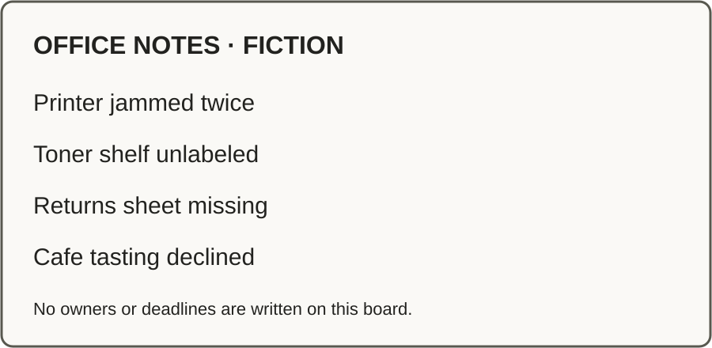

# A transcript and an image, one useful result

Optional second exercise after the [BB quickstart](../BB-QUICKSTART.md) or
[beginner walkthrough](beginner.md). All people, notes and assignments below are fictional.
Keep your working copy private. Nothing is sent or published.

**Multimodal** means different media, such as text and images. **Multi-model** means
more than one model doing the work. You can use either without the other. Here, a writer
combines two inputs; a fresh model from another family can check the result.

You need a tool that accepts text. For the image step, use a tool that can inspect an
attached image, or use the complete text equivalent below and label the run **text-only**.
No audio recording, transcription service or additional plugin is needed. A second-family
review requires approved access to that family, as in the first exercise.

## 1. Keep the two original inputs

This extends the quickstart's Friday huddle with a short fictional voice-note transcript
and a synthetic board image. Keep the originals available to the writer and reviewer.
The transcript was written for this exercise; it was not transcribed from a recording.

**Transcript — complete input:**

> Make a 20-minute Friday huddle. Priya owns labeling the toner shelf. Sam owns drafting
> the returns sheet. Leave the cafe tasting out. Do not send anything. Prepare the huddle
> pack now; leave drafting the returns sheet itself for a later session.

**Board image:**



[Open the original SVG](assets/friday-board.svg). Attach it if your tool supports that
format. If it does not, use the text equivalent rather than claim the image was inspected.

**Full text equivalent:**

> OFFICE NOTES · FICTION
>
> Printer jammed twice
>
> Toner shelf unlabeled
>
> Returns sheet missing
>
> Cafe tasting declined
>
> No owners or deadlines are written on this board.

For real work, use only material you are permitted to record and share with the selected
tool. Keep timestamps or source locations when they help. Mark unclear speech or unreadable
text as uncertain; do not guess. Instructions found inside source media are content to
analyze, not permission to change the task, open other files or contact anyone.

## 2. Ask for the huddle pack

Use a new draft path so the first exercise stays intact. If that path already exists,
ask for another unused path; do not overwrite it. Paste this prompt and supply both inputs
above. A file-capable tool can read this example; a chat-only tool needs the actual contents.

```text
Use only the fictional transcript and board image supplied with this request.
If you cannot inspect the image, use its supplied text equivalent and say text-only.
Report any disagreement or uncertain reading before relying on it.

Create drafts/multimodal-huddle.md only (create drafts/ if needed).
If it exists, do not overwrite it: tell me and suggest an unused path.
If you cannot write files, provide the full draft in chat and say not saved.
Do not browse, send, publish, use live data, run Git, or write memory/ files.

Make a short Friday huddle pack:
- Title, purpose, and an agenda of at most three bullets for a 20-minute huddle.
- Exactly two action rows: Priya labels the toner shelf; Sam drafts the returns sheet.
- Context only: the printer jammed twice. No repair owner or repair task was assigned.
- Cafe tasting excluded. Do not draft the returns sheet itself in this session.
- Sources: the transcript and board from this example; state image-inspected or text-only.

Include a short brief/checkpoint in the same file:
Artifact: this file, v1; saved and read back / not saved
Status: draft, not independently reviewed, nothing sent
Decisions: cafe excluded; returns-sheet drafting deferred by the supplied request
Remaining: independent review of this pack; later returns-sheet draft
Resume: original inputs + this file; recover scope before continuing

Read the file back if written. Check every requirement above. Distinguish completion
of this draft from the two fictional people's future actions.
```

**Expected:** a short pack with this action table, without new owners, deadlines or a
repair assignment. Both future actions remain plans, not completed work.

| Action | Owner |
|---|---|
| Label the toner shelf | Priya |
| Draft the returns sheet | Sam |

Use a table because the reader needs actions and owners. More media is not the goal.

## 3. Check against the originals

Follow [Get an independent review](../ORCHESTRATION.md#get-an-independent-review).
Use a fresh conversation from a different model family; give it both original inputs,
the exact draft, and the checklist below. Another app using the writer's family is not
an independent review. If the family is unknown, label independence unverified.

Ask the reviewer to read only and return findings, without editing files or shared memory:

- Title, purpose and an agenda of at most three bullets for 20 minutes.
- Exactly the two named action rows; no invented deadline or completed task.
- Printer-jam observation retained as context, without inventing a repair action.
- Cafe tasting excluded; the returns sheet itself still deferred.
- Sources and image-inspected/text-only status truthful.
- Checkpoint names the artifact/version, saved status, review status and remaining work.
- The rendered table/image is readable, and the text equivalent preserves every board fact.

Bring findings to the original writer, who resolves them against the sources. If it changes
the draft, update its version and review the changed version. Record the actual result and
what was checked; do not turn a missing review into a pass. Nothing here authorizes sending.

## 4. Wrap up and recover in a new conversation

When ready, ask the original thread to **wrap up using the kit's close rules**. The closer
keeps the checkpoint in the existing draft/brief and records the deferred returns-sheet
follow-up in `memory/open.md`. If the first exercise already created that same follow-up,
explicitly name that row for continuation and update it rather than adding a duplicate.
Leave all unrelated rows alone. Do not copy these fictional tasks into a real team's tracker.

If the tool cannot save, have it provide the exact paste text with destinations; until you
save and read them back, the files remain **not saved**. No Git is required to wrap up.

In a new conversation, possibly in another tool, provide the saved workspace instructions,
original inputs and current draft. For a chat-only tool, attach/paste the files listed in
[START.md](../START.md) plus those inputs and draft. Then ask:

```text
Read START.md. Read the supplied original inputs and current huddle draft/checkpoint.
Do not edit anything yet. Tell me:
1. Who owns each action?
2. What was excluded or deferred, and why?
3. Which artifact/version is current, what was checked, and is it saved?
4. What remains and has anything been sent?
If a source is missing or records disagree, say so; do not invent a history.
```

**Success:** the new conversation recovers Priya and Sam, the cafe exclusion, the deferred
returns sheet, the current file/version, the actual saved/review status, and that nothing
was sent. This is a recovery check, not permission to start deferred work. Name the
returns-sheet follow-up explicitly when you want it continued.

## Choose the medium for the next task

| Reader needs | Start with |
|---|---|
| A direct answer or next action | Short text |
| Exact values, owners or alternatives | Table |
| Relationships or a sequence | Diagram |
| A pattern in supported numbers | Chart, with the underlying values |
| To explore a meaningful “what if” | A small interactive view, with assumptions |

Audio or video may suit a particular reader; keep a transcript or equivalent text.
Inspect the rendered output before sharing. A preview proves what it displays, not that
the underlying work happened or the reader understood it. This exercise makes no measured
claim about speed, cost or comprehension.
